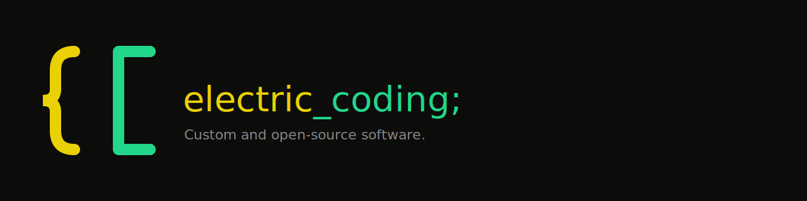

  

# electric_coding;

Custom and open-source software.

Electric Coding builds small, focused software with a bias for clarity, useful defaults, and sharp edges where they help.

## What We Make

- Open-source developer tools
- Small utilities with clear operational value
- Product and infrastructure work we can run ourselves

## Selected Projects

- **Baxter**: a simple, secure macOS backup utility with an S3 backend
- **Synapse**: an MCP server that lets Claude Code delegate coding tasks to Codex
- **Plugins**: small open-source integrations and tooling maintained by Electric Coding

## Working Style

- Keep things simple
- Prefer readable systems over clever ones
- Ship useful software, then tighten it

## Follow Along

Repositories here are the public workbench. Expect active iteration, uneven edges, and steady cleanup.

Contact: [info@electriccoding.com](mailto:info@electriccoding.com)
